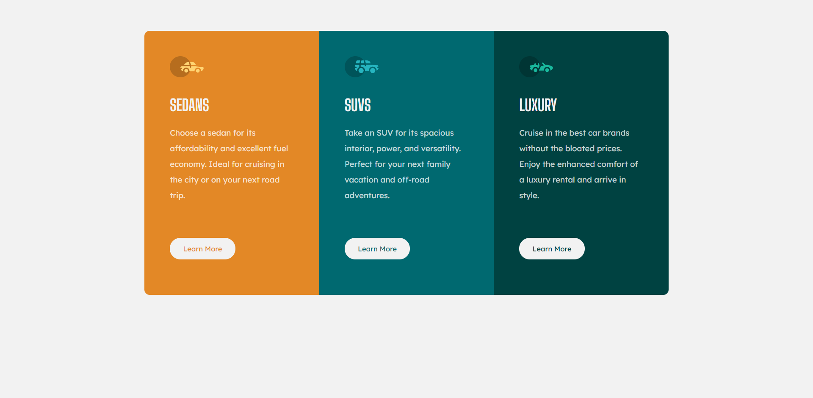

## Table of contents

- [Overview](#overview)
  - [Screenshot](#screenshot)
  - [Links](#links)
- [My process](#my-process)
  - [Built with](#built-with)
  - [What I learned](#what-i-learned)
- [Author](#author)

## Overview

### Screenshot

### Links

[Live Site](https://sonndy.github.io/Column-CSS/index.html)

## My process

### Built with

- Semantic HTML5 markup
- Flexbox
- Mobile-first workflow

### What I learned
I learned the importance of a mobile first workflow, and how important it is to plan out the structure of my HTML before creating a website. Moreover, I learn about how to visualize my website layout before creating the container for my flexbox.

## Author

- Website - [Add your name here](https://www.your-site.com)
